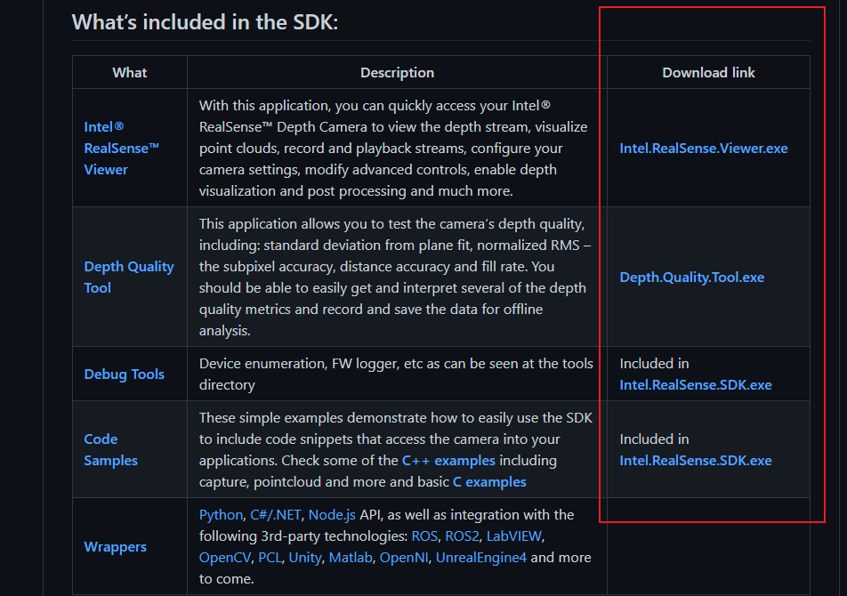
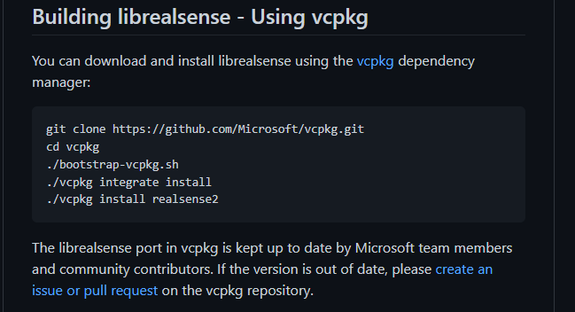
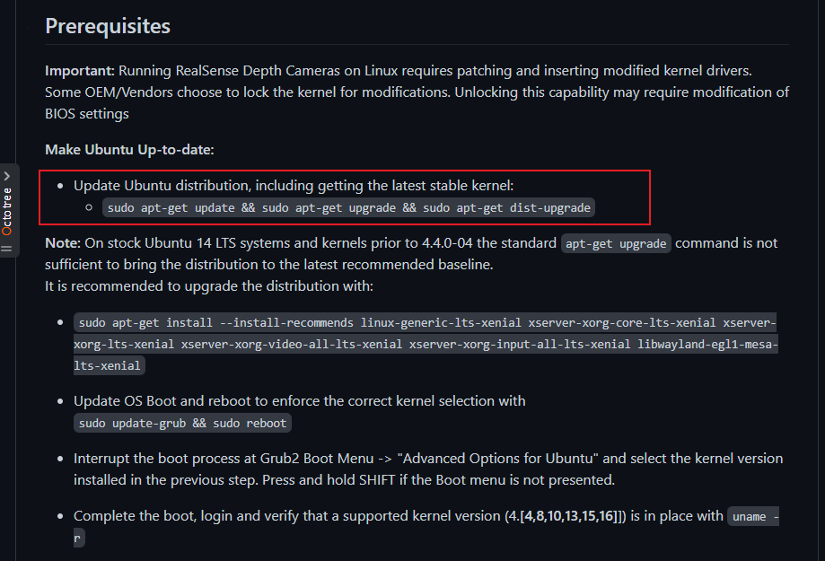
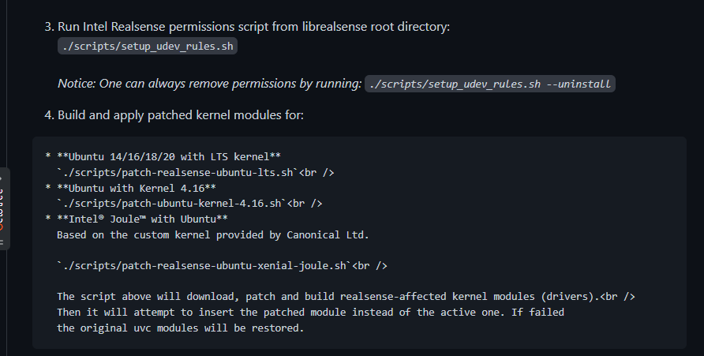
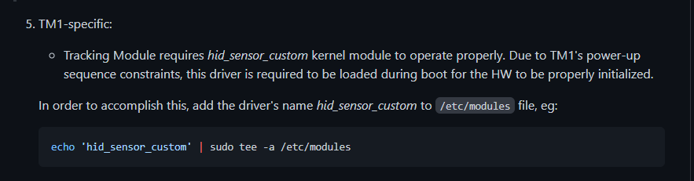
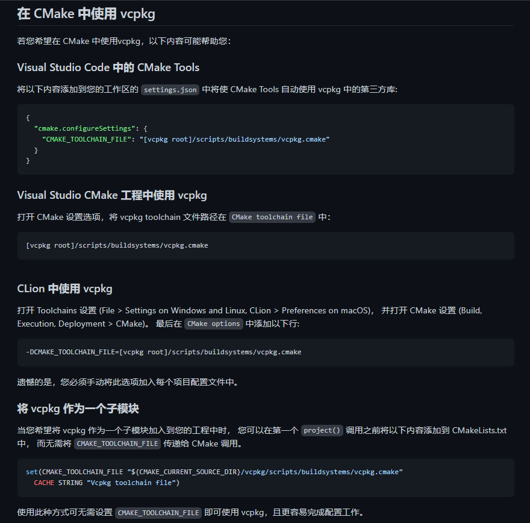
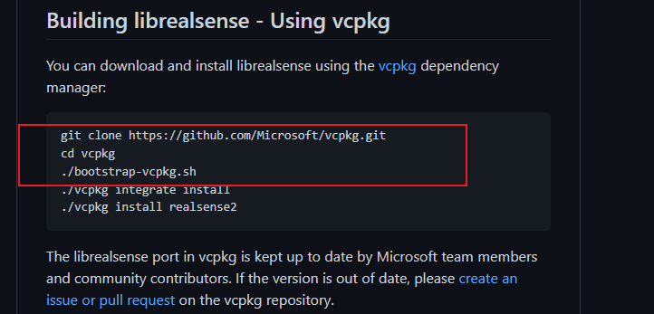
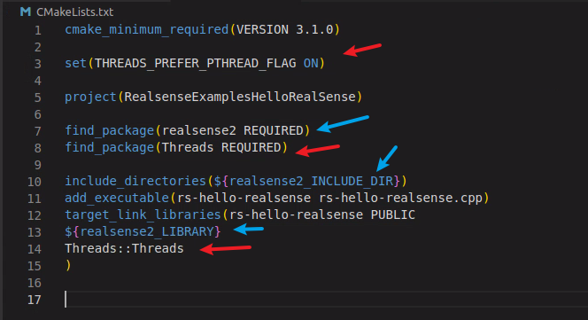
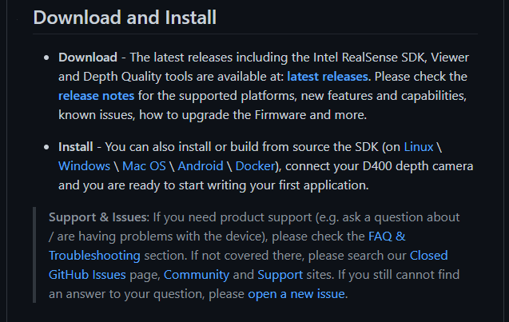

官方链接：https://github.com/IntelRealSense/librealsense/tree/v2.52.1
# 不使用代码
官方提供了.exe工具：[librealsense](https://github.com/IntelRealSense/librealsense/tree/v2.52.1)

# 使用代码
## 使用vcpkg
* 下载


注意：需要翻墙访问github，curl命令可能会失效，需要手动用wget下载包到对应位置再运行./vcpkg install realsense2。
* 运行一些命令
[Linux Ubuntu Installation](https://github.com/IntelRealSense/librealsense/blob/v2.52.1/doc/installation.md)



* vcpkg结合cmake调用相机
  * [vcpkg](https://github.com/microsoft/vcpkg)


  其中vcpkg在下载realsense的时候已经下了。


  * [官网demo](https://github.com/IntelRealSense/librealsense/tree/v2.52.1/examples)。找到Hello-RealSense

  * 修改cmakelist
```
cmake_minimum_required(VERSION 3.1.0)

set(THREADS_PREFER_PTHREAD_FLAG ON)

project(RealsenseExamplesHelloRealSense)

find_package(realsense2 REQUIRED)
find_package(Threads REQUIRED)

include_directories(${realsense2_INCLUDE_DIR})
add_executable(rs-hello-realsense rs-hello-realsense.cpp)
target_link_libraries(rs-hello-realsense PUBLIC 
${realsense2_LIBRARY}
Threads::Threads
)
```
其中红色箭头开启多线程（不然realsense报错），蓝色是从vcpkg下载的包中找出realsense，链接到cmake。

  * 修改main函数代码
```
    // Create a Pipeline - this serves as a top-level API for streaming and processing frames
    rs2::pipeline p;
    rs2::config cfg;
    cfg.enable_stream(RS2_STREAM_DEPTH, 640, 480, RS2_FORMAT_Z16, 30);
    cfg.enable_stream(RS2_STREAM_COLOR, 640, 480, RS2_FORMAT_BGR8, 30);
    // Configure and start the pipeline
    p.start(cfg);
```
把分辨率改小。不然会报错。我认为的原因：我找到的usb线是2.0的，传输率没usb3.0高，因此分辨率太大的话会超时。
  * 坑：vcpkg结合cmake使用有点恶心，需要了解cmake的find_package运行机制。[Cmake之深入理解find_package()的用法](https://zhuanlan.zhihu.com/p/97369704)。还有include_directories，target_link_libraries的使用。知道find_package的机制后，需要找到realsense2Config.cmake文件，看里面有什么变量才能编写对应的cmakelist。
* todo：官方提供的sdk文档就得你们去研究了。

## 从源码用cmake下载
没试过，感兴趣自己去摸索。
